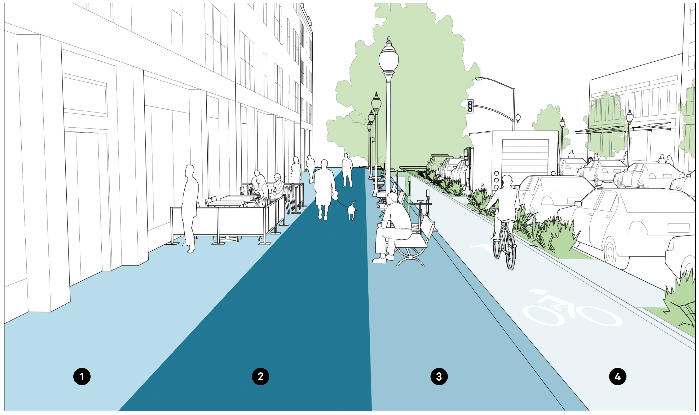

# Sidewalks

Sidewalks play a vital role in city life. As a conduit for pedestrian movement and access, they enhance connectivity and promote walking. As public spaces, sidewalks serve as the front steps to the city, activating streets socially and economically. Safe, accessible, and well-maintained sidewalks are a fundamental and necessary investment for cities, and have been shown to enhance general public health and maximize social capital.

Just as roadway expansions and improvements have historically enhanced travel for motorists, superior sidewalk design can encourage walking by making it more attractive.

Curb cuts for vehicle access should be limited in areas with high pedestrian volumes, and when unavoidable, they must maintain accessible levels, slopes, and clear path minimums.

### 1. Frontage Zone
The frontage zone defines the section of the sidewalk that functions as an extension of the building, whether through entryways and doors or sidewalk cafés and sandwich boards. The frontage zone consists of both the facade of the building fronting the street and the space immediately adjacent to the building.

### 2. Clear Path
The pedestrian clear path defines the primary, dedicated, and accessible pathway that runs parallel to the street. The clear path ensures that pedestrians have a safe and adequate place to walk and should be 1.8–2.4 m wide in residential settings and 2.4–4.5 m wide in downtown or commercial areas with heavy pedestrian volumes.

### 3. Street Furniture Zone 
The street furniture zone is defined as the section of the sidewalk between the curb and the clear path, in which street furniture and amenities such as lighting, benches, newspaper kiosks, transit facilities, utility poles, tree pits, and cycle parking are provided. The street furniture zone may also contain green infrastructure elements such as rain gardens, trees, or flow-through planters.

### 4. Buffer Zone 
The enhancement or buffer zone is defined as the space immediately next to the sidewalk, and may consist of a variety of different elements. These include curb extensions, parklets, stormwater management features, parking, cycle racks, cycle share stations, and curbside cycle tracks.

## References
1. Sidewalks, [Global Design Cities Initiative](https://globaldesigningcities.org/publication/global-street-design-guide/designing-streets-people/designing-for-pedestrians/sidewalks/)
